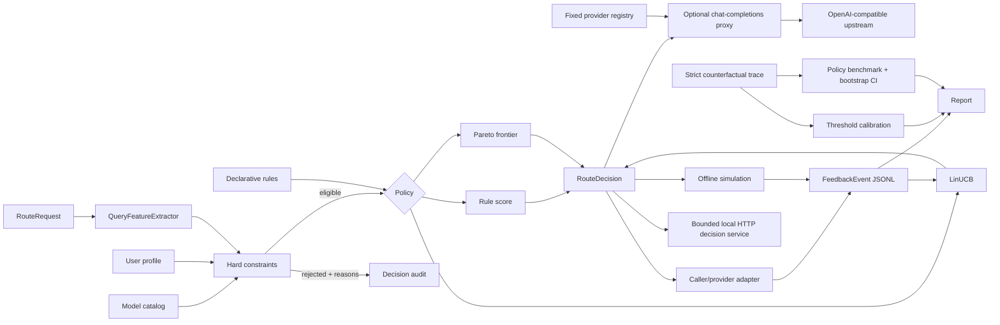

# FacetRoute

[](https://github.com/appleweiping/FacetRoute/actions/workflows/ci.yml)
[](https://github.com/appleweiping/FacetRoute/actions/workflows/codeql.yml)
[](https://www.python.org/)
[](LICENSE)

FacetRoute is an original, offline-first Python library for choosing among a
declared set of large-language-model candidates. It treats routing as a
transparent decision problem: reject models that cannot satisfy the request,
score the remaining trade-offs, explain the result, optionally learn from
local feedback, and—only when explicitly configured—execute the selected model
through an OpenAI-compatible provider.

Offline routing, simulation, calibration, and benchmarks never call a provider,
download a model, require an API key, or send telemetry. The optional proxy is
disabled unless a provider-binding file is supplied. The package retains zero
runtime dependencies beyond Python 3.11 or newer.

## Why this project exists

Model routing often becomes an opaque collection of price tables, provider
conditionals, and learned scores. FacetRoute separates those concerns:

- a model catalog describes capabilities and operating limits;
- a request declares non-negotiable constraints;
- a user profile declares quality, cost, and latency preferences;
- deterministic policies produce auditable decisions;
- a contextual bandit learns only after explicit feedback is recorded;
- counterfactual benchmarks and calibration measure behavior before a policy
  is used in an application.

Applications can use FacetRoute only for model selection or opt into its narrow
provider boundary. Provider credentials always come from named environment
variables rather than request bodies or configuration-file values.

## Architecture



The important invariant is that every policy receives only models that passed
the same hard-constraint engine. A rule or Bandit confidence interval can
change preferences; neither can make an ineligible model selectable.

## Features

- **Model candidate specification**: capabilities, per-task quality, input and
  output price, p50/p95 latency, context window, regions, tool/JSON support,
  enabled state, and inspectable metadata.
- **Deterministic query features**: task category, token approximation,
  difficulty, code/math signals, question count, multi-step language, and
  required capabilities. No embeddings or network calls are required.
- **Personalized objectives**: quality/cost/latency weights, task-specific
  overrides, preferred and blocked models, cost and latency budgets, region,
  minimum quality, and exploration strength.
- **Hard constraints**: context capacity, required capabilities, tools,
  structured output, region, restricted-data locality, budgets, model state,
  and profile blocks.
- **Explainable scoring**: normalized cost and latency utility alongside raw
  task quality, explicit bonuses, ranked alternatives, rejected candidates,
  and human-readable reasons.
- **Three policies**:
  - `RuleRouter` applies serializable rules as bounded score bonuses;
  - `ParetoRouter` removes quality/cost/latency-dominated candidates;
  - `LinUCBRouter` learns per-model reward estimates and uncertainty online.
- **Local state**: atomic versioned JSON for Bandit/profile state and
  append-only JSONL feedback suitable for inspection and replay.
- **Strict counterfactual traces**: duplicate-key and non-finite-number
  rejection, stable request IDs, bounded line/record sizes, complete observed
  outcome validation, and SHA-256 provenance.
- **Calibration and policy benchmarks**: strong/weak score thresholds,
  cost-quality Pareto curves, fixed-model baselines, rule/Pareto/LinUCB
  comparisons, quality regret, constraint violations, and seeded bootstrap
  confidence intervals.
- **Benchmark format adapters**: strict, offline normalization for the public
  MMLU, GSM8K, and MT-Bench JSON/JSONL record shapes. Answers remain separate
  from the routing prompt, and every normalized request receives a stable ID.
- **Portable reports**: deterministic JSON, analysis-ready CSV, and a
  standalone HTML table with an embedded reproducibility manifest.
- **Decision and execution service**: standard-library `/health`, `/v1/models`,
  `/v1/route`, and optional `/v1/chat/completions` endpoints with bounded
  request/response/event sizes, concurrency and timeouts; non-streaming JSON and
  chunked SSE; injectable providers; environment-only credentials; optional
  bearer authentication; and redacted structured upstream failures.
- **CLI**: `route`, `simulate`, `feedback`, `report`, `split-traces`, `calibrate`,
  `benchmark`, `normalize-benchmark`, and `serve`.

## Install

```bash
python -m pip install -e .
```

Development tools are optional:

```bash
python -m pip install -e ".[dev]"
```

## Five-minute offline walkthrough

Route one request with the deterministic rule policy:

```bash
facetroute route \
  --models examples/models.json \
  --preferences examples/preferences.json \
  --rules examples/rules.json \
  --policy rule \
  --user analyst \
  --task math \
  --query "Derive the beta-binomial posterior step by step"
```

On PowerShell, use backticks instead of backslashes, or place the command on a
single line. The result is JSON containing the chosen identifier, the complete
score breakdown, alternatives, exclusions, matched rules, extracted features,
and an explanation.

Run a seeded simulation and learn after each synthetic observation:

```bash
facetroute simulate \
  --models examples/models.json \
  --preferences examples/preferences.json \
  --rules examples/rules.json \
  --queries examples/queries.jsonl \
  --policy linucb \
  --state bandit-state.json \
  --feedback-log feedback.jsonl \
  --learn \
  --seed 17 \
  --output simulation-report.json
```

Summarize recorded feedback:

```bash
facetroute report --log feedback.jsonl
```

Everything above is local. Names in `examples/models.json` are fictional and
the simulator does not contact them.

Calibrate a pairwise router and compare all policies against the included
counterfactual fixture:

```bash
facetroute calibrate \
  --traces examples/traces.jsonl \
  --max-average-cost 0.0025 \
  --output artifacts/calibration.json \
  --csv artifacts/cost-quality.csv

facetroute benchmark \
  --models examples/models.json \
  --preferences examples/preferences.json \
  --rules examples/rules.json \
  --traces examples/traces.jsonl \
  --bootstrap-samples 1000 \
  --seed 17 \
  --output-dir artifacts/benchmark
```

The benchmark writes `benchmark.json`, `benchmark.csv`, and a standalone
`benchmark.html`. The included trace is a fictional format demonstration, not
a published performance claim.

Normalize a public benchmark export before constructing counterfactual traces:

```bash
facetroute normalize-benchmark \
  --input mmlu_test.json \
  --format mmlu \
  --output artifacts/mmlu.jsonl
```

The adapter accepts MMLU (`question`, `choices`, `answer`), GSM8K
(`question`, `answer`), and MT-Bench (`question_id`, `turns`, optional
`category`) records as JSON arrays, objects, or JSONL. It validates IDs,
choices, answers, duplicate records, file size, and record count. The output is
canonical JSONL with a reproducible `format:id` request key. The answer is kept
in the normalized record for an evaluator, but is never concatenated into the
request query; model scoring and quality outcomes must still be supplied by a
separate, explicitly hashed trace.

For an actual experiment, split before inspecting metrics and keep related rows
together. The command records declared provenance, exact source bytes, the split
algorithm, requested fractions, and both byte and canonical hashes:

```bash
facetroute split-traces \
  --traces /data/router-outcomes.jsonl \
  --output-dir artifacts/split \
  --dataset-name "declared evaluation snapshot" \
  --source-uri "https://example.org/versioned-dataset" \
  --license "declared-license" \
  --group-by user_id \
  --seed 17

facetroute calibrate \
  --traces artifacts/split/calibration.jsonl \
  --held-out-traces artifacts/split/test.jsonl \
  --held-out-group-by user_id \
  --max-average-cost 0.0025 \
  --output artifacts/held-out-calibration.json
```

The selected threshold sees only the calibration partition. FacetRoute rejects
overlap at the declared request, user, or metadata leakage unit, as well as a
changed strong/weak model pair, before evaluating the threshold once on the
held-out partition. The report records that leakage key and both group counts.
Without `--held-out-traces`, the established calibration report schema remains
version 1; reports with held-out audit data use schema 2. See the
[experiment protocol](docs/experiment-protocol.md) for the complete boundary.

## Python API

```python
from facetroute import (
    ModelCandidate,
    ParetoRouter,
    RouteRequest,
    UserPreferences,
)

models = (
    ModelCandidate(
        model_id="small-local",
        display_name="Small Local",
        capabilities=frozenset({"text", "code"}),
        input_cost_per_million=0,
        output_cost_per_million=0,
        latency_ms_p50=70,
        latency_ms_p95=140,
        context_window=8_192,
        quality_by_task={"default": 0.55, "code": 0.68},
        regions=frozenset({"local"}),
        metadata={"local": True},
    ),
    ModelCandidate(
        model_id="deep-remote",
        display_name="Deep Remote",
        capabilities=frozenset({"text", "code", "reasoning"}),
        input_cost_per_million=2,
        output_cost_per_million=6,
        latency_ms_p50=500,
        latency_ms_p95=1_100,
        context_window=65_536,
        quality_by_task={"default": 0.86, "code": 0.92},
        regions=frozenset({"us", "eu"}),
    ),
)

profiles = {
    "sam": UserPreferences(
        user_id="sam",
        quality_weight=0.45,
        cost_weight=0.4,
        latency_weight=0.15,
    )
}

router = ParetoRouter(models, profiles)
decision = router.route(
    RouteRequest(
        query="Write a Python parser for this line format",
        user_id="sam",
        max_cost_usd=0.01,
    )
)

print(decision.selected_model)
print(decision.breakdown.to_dict())
print(decision.explanation)
```

### Batch routing

Every built-in router supports `route_many`; `BatchRouter` adapts any object
with `route(request)`:

```python
from facetroute import BatchRouter

result = BatchRouter(router).route(requests, fail_fast=False)
for decision in result.decisions:
    print(decision.request_id, decision.selected_model)
for index, error in result.errors.items():
    print("failed input", index, error)
```

The decision tuple retains input order. When `fail_fast=False`, failures are
keyed by original input index and successful requests continue.

## Catalog and request formats

The model catalog is a JSON list or an object containing `models`. Costs use
USD per million tokens, latencies use milliseconds, and quality is normalized
to `[0, 1]`:

```json
{
  "models": [{
    "model_id": "model-a",
    "display_name": "Model A",
    "capabilities": ["text", "reasoning", "json"],
    "input_cost_per_million": 0.5,
    "output_cost_per_million": 1.5,
    "latency_ms_p50": 250,
    "latency_ms_p95": 600,
    "context_window": 32768,
    "quality_by_task": {"default": 0.72, "reasoning": 0.81},
    "regions": ["us", "eu"],
    "supports_tools": false,
    "supports_json": true,
    "enabled": true,
    "metadata": {"local": false}
  }]
}
```

Simulation requests are one JSON object per line. Important optional fields:

- `user_id`, `request_id`, `task_hint`;
- `expected_output_tokens` and an explicit `context_tokens` override;
- `required_capabilities`, `needs_tools`, `needs_json`;
- `max_cost_usd`, `max_latency_ms`, and `region`;
- `sensitivity`: `normal`, `sensitive`, or `restricted`.

`restricted` is deliberately strict: only a candidate with
`metadata.local=true` passes. `sensitive` is a label applications may use in
their own rules; FacetRoute does not silently infer legal or privacy policy.
A request cannot override a different `required_region` in its user profile;
that conflict rejects every candidate instead of weakening the profile.

## Routing policies

FacetRoute ships four policies, and they form one class hierarchy:
`ParetoRouter` and `LinUCBRouter` subclass `RuleRouter`, and `ThompsonRouter`
subclasses `LinUCBRouter`, each overriding only how the eligible set is narrowed
or re-scored. Every policy therefore runs the same
`ConstraintEngine` and the same `MultiObjectiveScorer` before it chooses, and
each decision records the policy that produced it. Select one with
`--policy rule` (the default), `--policy pareto`, `--policy linucb`, or
`--policy thompson` on `route`, `simulate`, and `serve`; `benchmark` accepts the
same four names plus `fixed` for single-model baselines.

Only `linucb` and `thompson` hold state or change with feedback. `rule` and `pareto` are
functions of the catalog, the profile, the rules, and the request alone, so the
same inputs always yield the same selection and the same score.

The same request under all three:

```bash
show='import json, sys
decision = json.load(sys.stdin)
print(decision["policy"], decision["selected_model"], round(decision["score"], 4))'

for policy in rule pareto linucb; do
  facetroute route \
    --models examples/models.json \
    --preferences examples/preferences.json \
    --rules examples/rules.json \
    --policy "$policy" \
    --user analyst \
    --task math \
    --query "Derive the beta-binomial posterior step by step" \
  | python -c "$show"
done
```

```text
rule marble-reasoner 0.829
pareto marble-reasoner 0.829
linucb marble-reasoner 0.8534
```

The projection only keeps the example short; `route` still prints the complete
decision JSON described above. All three pick `marble-reasoner` here. The
LinUCB total is higher because an untrained arm predicts reward `0.0000` and
adds its exploration bonus on top of the weighted deterministic prior, which is
visible in that decision's own `explanation` field.

### Rule policy

The rule policy performs four steps:

1. extract deterministic request features;
2. remove candidates that violate hard constraints;
3. normalize eligible cost and latency, then combine them with task quality;
4. apply matched user/model preference bonuses and choose by score, breaking
   exact ties by `model_id`.

Rules are data, not Python callbacks. A rule matches tasks, capabilities, and a
difficulty interval, then adds a declared bonus to listed eligible models.
This keeps configuration serializable and explanations repeatable.

### Pareto policy

For each eligible candidate, Pareto routing uses three objectives:

- maximize task quality;
- minimize estimated request cost;
- minimize p95 latency.

A model is dominated only when another model is at least as good on every
objective and strictly better on one. Multi-objective scoring chooses within
the resulting frontier. Equal points remain on the frontier.

### LinUCB policy

LinUCB maintains an independent linear reward model for every model identifier.
Its context is a bounded 16-value vector containing query difficulty, estimated
length, code/math/multi-step signals, task one-hot values, and normalized user
objective weights.

The selection value is:

```text
predicted reward + alpha × profile exploration × uncertainty
                 + prior_weight × deterministic score
```

The deterministic prior makes cold-start choices operationally sensible while
confidence encourages exploration. Updates use a Sherman–Morrison inverse
covariance update implemented with the Python standard library. Rewards must be
explicit finite values in `[0, 1]`.

State JSON stores inverse covariance matrices, reward vectors, update counts,
dimension, `alpha`, ridge strength, and a schema version. Save operations write
and fsync a temporary file in the same directory before `os.replace`.

### Optimism or sampling

`linucb` and `thompson` share one posterior. Each arm keeps the same covariance
and reward vector, and `alpha` means the same thing to both -- the multiplier on
an arm's uncertainty. Only the way a score is drawn from that posterior differs:

- `linucb` scores every arm at the top of its confidence interval, so the arm it
  tries is always the most hopeful one.
- `thompson` draws from each arm's posterior, so an arm is tried roughly in
  proportion to the probability that it is best.

They differ most where several arms are plausible: optimism keeps returning to
whichever interval is widest, while sampling spreads across them. A saved state
loads under either policy, so a deployment can switch without discarding what it
has learned.

Sampling is made a function of the request rather than of a generator, so a
decision stays reproducible: the same request against the same state always
draws the same value, while a different request -- or a different `seed` --
explores elsewhere. A routing log therefore replays to the routes it recorded,
which a generator advanced per call could not do.

**Which is better is an empirical question about your traffic, not a property of
the rule.** On one synthetic linear-reward world with four arms over 1,200
rounds, averaged across five worlds, neither dominates and the ordering flips
with the exploration scale:

| `alpha` | `linucb` regret | `thompson` regret |
|---:|---:|---:|
| 0.05 | 33.4 | 47.3 |
| 0.10 | **32.1** | **37.2** |
| 0.20 | 41.2 | **38.7** |
| 0.35 (default) | 40.7 | 49.6 |
| 0.60 | 47.8 | 51.5 |

Two things are worth reading off that table rather than from the literature. The
shipped default of `0.35` is best for neither policy in this world, so `alpha` is
worth tuning on your own traffic. And `thompson` is not a free improvement: it
explores more, which costs regret where the arms are close together and pays
where they are not. `benchmark --policy linucb --policy thompson` runs both
against the same requests so the comparison is made on your data instead of on
this one.

## Feedback and replay

A `FeedbackEvent` records:

- stable event/request/user/model identifiers and timestamp;
- normalized reward and success flag;
- policy and the exact Bandit context vector;
- optional observed latency, cost, and string tags.

`FeedbackLog` rejects duplicate event IDs and reports malformed line numbers.
Because JSONL is append-only and provider-independent, teams can inspect,
filter, redact, or replay observations using ordinary tools.

Append feedback through the CLI:

```bash
facetroute feedback \
  --log feedback.jsonl \
  --request-id request-42 \
  --user sam \
  --model model-a \
  --reward 0.9 \
  --policy rule \
  --latency-ms 410 \
  --cost-usd 0.0012
```

LinUCB feedback always requires the decision's JSON `context_vector` through
`--context`. Pass an existing `--state` as well to update it immediately.

## Calibration traces

Each strict JSONL trace contains one provider-independent request and observed
counterfactual outcomes keyed by model ID. Pairwise calibration additionally
declares `strong_model`, `weak_model`, a `route_score` in `[0, 1)`, and an
optional human or task-metric `preferred_model` label. Threshold `t` chooses
the strong model when `route_score >= t`; threshold `1` always chooses weak.

```json
{
  "request_id": "eval-001",
  "request": {"query": "Local evaluation input", "request_id": "eval-001"},
  "outcomes": {
    "small": {"quality": 0.71, "cost_usd": 0.001, "latency_ms": 90, "success": true},
    "strong": {"quality": 0.89, "cost_usd": 0.012, "latency_ms": 510, "success": true}
  },
  "preferred_model": "strong",
  "route_score": 0.82,
  "strong_model": "strong",
  "weak_model": "small"
}
```

Input rejects duplicate JSON keys, `NaN`/infinity, unknown trace/outcome
fields, duplicate or unstable request IDs, inconsistent pairs, missing
outcomes, and oversized records. See [the trace schema](docs/trace-schema.md).

`split-traces` can keep a `user_id` or a declared string `metadata:<field>`
together, preventing that group from appearing in more than one partition.
The default groups only by request ID and is appropriate only when rows are
independent. The produced training partition is for fitting the upstream
route-score model or policy; FacetRoute does not pretend that a supplied
`route_score` was trained without leakage.

## Offline benchmark methodology

`benchmark` replays the same ordered traces through rule, Pareto, fresh online
LinUCB, and fixed-candidate policies by default. For each selection it looks up
the already observed outcome; it never makes a model call. Reports contain:

- quality, observed cost, latency, p95 latency, and success;
- quality regret against the best observed eligible candidate;
- routing failure and hard-constraint violation rates;
- selection counts and index-keyed, non-traceback errors;
- seeded percentile-bootstrap intervals;
- exact trace/configuration and canonical catalog SHA-256 digests.

Fixed baselines deliberately remain selectable when ineligible so their
violation rate is visible. Confidence intervals describe sampling uncertainty
inside the supplied trace, not biased labels or distribution shift. See
[the benchmark methodology](docs/benchmark-methodology.md).

## Local routing service

Start a decision-only endpoint:

```bash
facetroute serve \
  --models examples/models.json \
  --preferences examples/preferences.json \
  --rules examples/rules.json \
  --policy pareto \
  --host 127.0.0.1 \
  --port 8080

curl -s http://127.0.0.1:8080/v1/route \
  -H 'Content-Type: application/json' \
  -d '{"query":"Explain this proof","user_id":"analyst"}'
```

Authentication is optional on loopback. For a non-loopback bind, set a token
without placing it in process arguments:

```bash
export FACETROUTE_BEARER_TOKEN='replace-with-a-secret'
facetroute serve --models examples/models.json --host 0.0.0.0
```

`POST /v1/route` accepts the native request or a text-only subset of an OpenAI
chat-shaped request and returns a routing decision without executing it.

To enable actual chat completions, bind every enabled catalog ID to a fixed
upstream model (the abbreviated example below shows one record):

```json
{
  "models": [
    {
      "model_id": "marble-reasoner",
      "upstream_model": "vendor/reasoner-v1",
      "base_url": "https://api.vendor.example/v1",
      "api_key_env": "VENDOR_API_KEY"
    }
  ]
}
```

```bash
export VENDOR_API_KEY='replace-with-a-secret'
facetroute serve \
  --models examples/models.json \
  --providers providers.json \
  --policy pareto

curl -N http://127.0.0.1:8080/v1/chat/completions \
  -H 'Content-Type: application/json' \
  -d '{"model":"facetroute","messages":[{"role":"user","content":"Explain this proof"}],"stream":true}'
```

The incoming virtual model is always `facetroute`; the selected catalog ID is
reported in `X-FacetRoute-Model`, while only the registry's fixed upstream name
is sent to the provider. A `facetroute` request object can carry cost, latency,
region, capability, sensitivity, task, context, and metadata constraints and is
removed before forwarding. See [the complete HTTP contract](docs/http-api.md).

## Simulation metrics

The included simulator is designed for policy plumbing and regression tests,
not as evidence that a real model has a given quality. With a fixed seed it:

- derives a synthetic reward from declared task quality, difficulty, an
  explicit preferred-model bonus, and bounded noise;
- samples latency between declared p50 and p95;
- computes success, estimated cost, selection counts, quality regret, and p95;
- optionally appends each observation and updates LinUCB online.

For research evaluation, replace synthetic rewards with held-out human or task
metrics while preserving the same `FeedbackEvent` contract.

## Design choices and limitations

- Token counts are a deterministic character-based approximation unless the
  request supplies `context_tokens`. Provider billing should use observed token
  counts after execution.
- Declared quality is configuration, not a claim about a real model. Keep it
  versioned with the benchmark and population that produced it.
- Counterfactual comparison requires an outcome for the selected model.
  Missing outcomes are failures; FacetRoute does not impute observations.
- Bootstrap intervals assume the supplied rows form a useful empirical
  population. They cannot repair judge bias, temporal leakage, or repeated
  tuning against the same holdout.
- Linear contextual Bandits cannot represent every interaction. Their value
  here is inspectability, fast online updates, and a small dependency surface.
- JSONL appends are protected inside one process, not coordinated across a
  distributed fleet. Use a transactional event store when multiple processes
  write the same stream.
- User identifiers are opaque strings. FacetRoute does not collect attributes
  or decide which personalization is legally or ethically appropriate.
- Offline commands and `/v1/route` never execute a selected model. The optional
  `/v1/chat/completions` endpoint executes only fixed, locally configured
  provider bindings.

## Privacy and safety defaults

- no outbound calls, downloads, telemetry, or prompt forwarding unless the
  operator explicitly starts `serve` with `--providers` and calls the chat
  completion endpoint;
- the optional inbound service binds to loopback by default, reads only its
  named bearer-token environment variable, and logs no headers or bodies;
- provider URLs cannot come from requests; plain HTTP providers are restricted
  to loopback unless the operator passes the explicit unsafe override;
- literal provider secrets are rejected by the configuration schema; keys are
  read from named environment variables and upstream error bodies are discarded;
- no model/provider names embedded in core routing logic;
- no automatic logging—callers must explicitly create a `FeedbackLog`;
- no raw query text in `FeedbackEvent` by default;
- restricted requests require a catalog entry explicitly marked local;
- every rejected candidate and numeric decision component is returned.

These defaults reduce accidental disclosure, but applications still need
access control, retention limits, encryption, redaction, and jurisdictional
review appropriate to their context.

## Development

```bash
python -m pip install -e ".[dev]"
ruff check src tests examples
ruff format --check src tests examples
mypy -p facetroute
pytest --cov=facetroute --cov-branch
python -m build
```

The test suite covers validation, deterministic feature extraction, every
constraint, score normalization, rules, Pareto dominance, batch errors,
LinUCB learning and persistence, feedback integrity, strict traces,
calibration, bootstrap benchmarking, reports, HTTP security/error boundaries,
provider registry validation, routed completion execution, bounded OpenAI-style
JSON/SSE handling, simulation, configuration, and all nine CLI commands. Tests
are offline and use temporary directories and loopback-only fixture servers.

See [CONTRIBUTING.md](CONTRIBUTING.md) for change and disclosure expectations
and [the release process](docs/releasing.md) for clean-install, SBOM, checksum,
and provenance guarantees.

## Algorithm reference

FacetRoute's code and interfaces are independently implemented. Its contextual
bandit uses the LinUCB update described by Li, Chu, Langford, and Schapire in
“A Contextual-Bandit Approach to Personalized News Article Recommendation”
(WWW 2010, DOI `10.1145/1772690.1772758`). The paper is cited for the algorithm;
no external project code is included.

## License

MIT. See [LICENSE](LICENSE).
Project policies and release history are in [CONTRIBUTING.md](CONTRIBUTING.md), [SECURITY.md](SECURITY.md), and [CHANGELOG.md](CHANGELOG.md).
